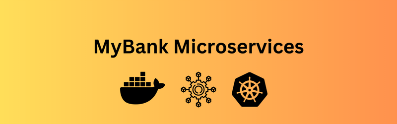
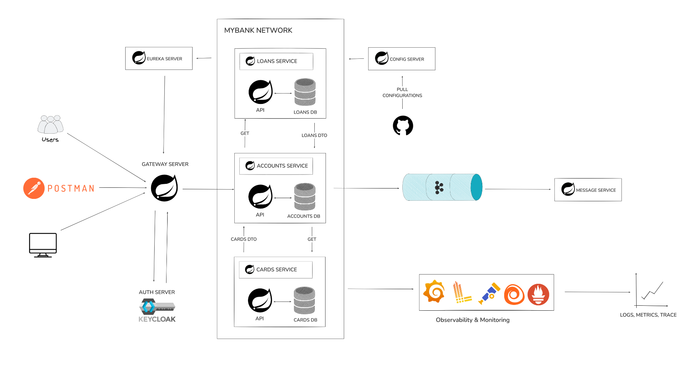
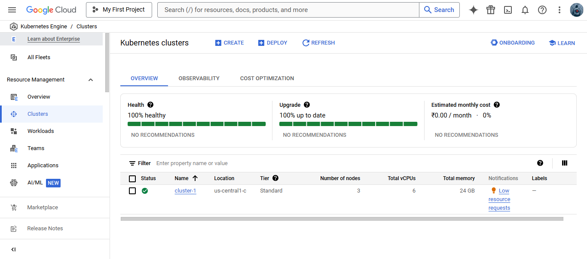
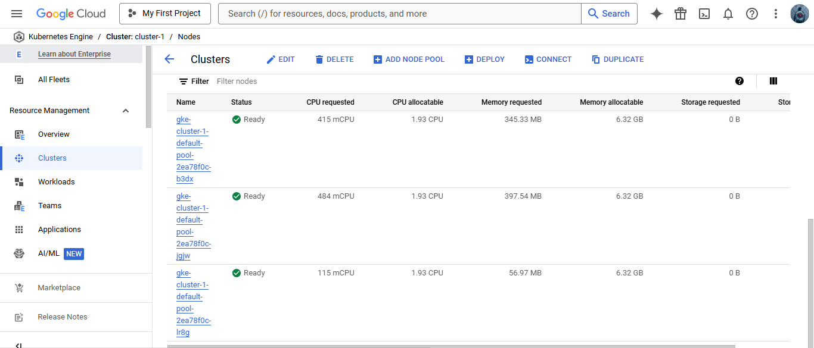
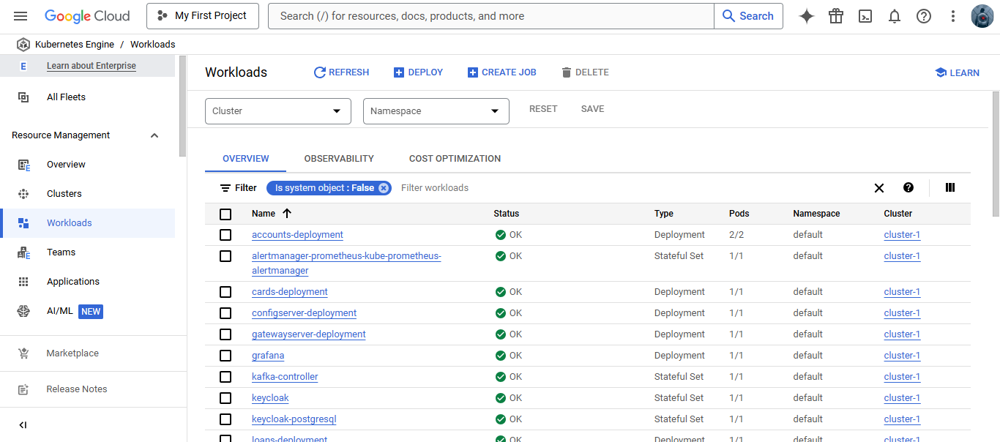
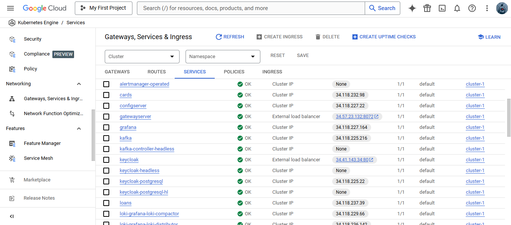
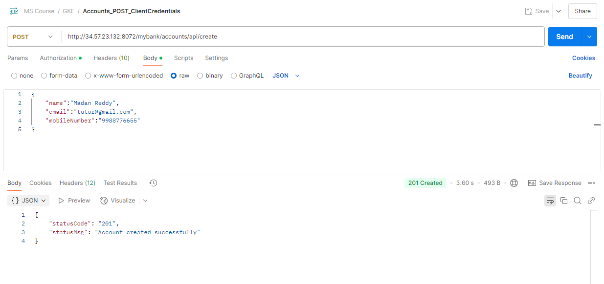
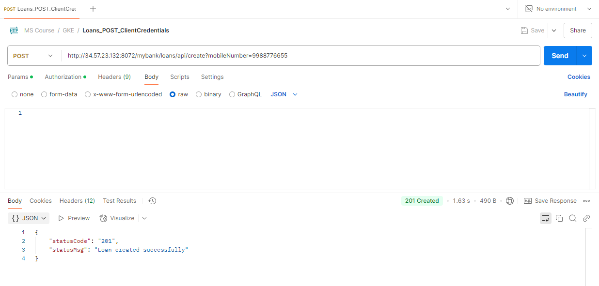
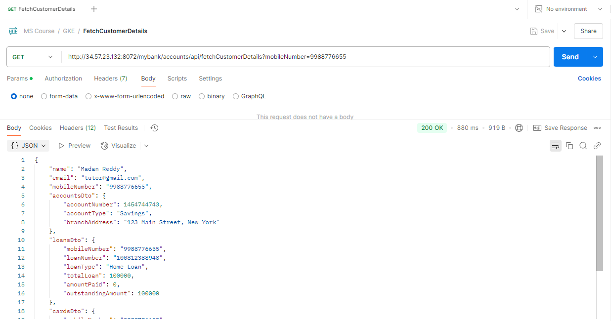

<p align="center">
 
</p>

<p>MyBank Microservices is a banking application built using the microservices architecture. The system consists of multiple microservices that handle different banking operations, along with supporting infrastructure for service discovery, configuration management, and API gateway routing. The application is containerized using Docker and deployed on Kubernetes (Local Cluster/ Google Kubernetes Engine) with observability enabled through the Grafana monitoring stack.</p>

## Microservices

- **Accounts Service**: Manages customer and account details. 

- **Cards Service**: Manages card details.

- **Loans Service**: Manages loan details.

## Supporting Services

- **Eureka Server**: Service discovery for microservices.

- **Config Server**: Centralized configuration management for all services. It pulls configurations from a github repository - [https://github.com/Haaris-Sayyed/mybank-config](https://github.com/Haaris-Sayyed/mybank-config)

- **API Gateway**: Routes client requests to appropriate services and handles authentication.

- **Message Service**: Listens for account-created events and sends email and SMS notifications to customers.

## Architecture Diagram


## Technologies Used
- **Spring Boot:** Backend framework for microservices.

- **Spring Cloud:** Service discovery, config management, API gateway.

- **Kafka:** Messaging for event-driven communication.

- **Docker:** Containerization of microservices.

- **Kubernetes:** Orchestration and deployment.

- **Grafana, Prometheus, Loki, Grafana Alloy, Grafana Tempo, Open Telemetry:** Monitoring and logging.

- **H2:** Databases for storing business data.

- **KeyCloak**: Authorization server.

# Docker Images
All above mentioned application docker images can be found on docker hub at - [https://hub.docker.com/u/sayyedhaaris](https://hub.docker.com/u/sayyedhaaris)

# Getting Started
<p>Clone the repository into your local machine using below command.</p>

```
git clone https://github.com/Haaris-Sayyed/mybank-microservices.git
```
## Pre-requisites
<p>You must have following softwares installed on your system to run this project.</p>

- Java 17
- Maven
- Docker / Docker Desktop
- Docker Compose 
- Helm
- Kubectl CLI Utility
- Gcloud CLI Utility

## How to run the project?
<p>Open the cloned repo folder in your favourite IDE and load all the maven modules.</p>

---

### On Local Machine

- Start keycloak and kafka docker containers using below commands:

```
$ docker run -p 8080:8080 -e KC_BOOTSTRAP_ADMIN_USERNAME=admin -e KC_BOOTSTRAP_ADMIN_PASSWORD=admin quay.io/keycloak/keycloak:26.1.3 start-dev

$ curl -o docker-compose.yml https://raw.githubusercontent.com/confluentinc/examples/master/docker-compose/kafka-single-node/docker-compose.yml

$ docker-compose up -d
```

- Navigate to application subfolders in the below mentioned order and run the following command to start the applications.

1. Config Server
2. Eureka Server
3. Accounts Microservice
4. Cards Microservice
5. Loans Microservice
6. Message Microservice
7. Gateway Server

```
mvn spring-boot:run
```

- After successful startup of the applications they can be accessed using below links

| Application Name| URL |
| ----- | ----|
|Config Server| http://localhost:8071/actuator/health |
|Eureka Server| http://localhost:8070/|
| Accounts Service| http://localhost:8080/swagger-ui/index.html|
| Cards Service| http://localhost:9000/swagger-ui/index.html |
| Loans Service| http://localhost:8090/swagger-ui/index.html|
| Gateway Server|http://localhost:8072/actuator/gateway/routes |

---

### Using Docker Compose 

- Navigate to docker-compose folder
```
cd docker-compose
```
- Navigate to any environment subfolder (default/prod/qa)
```
cd default
```
- Start applications using below command
```
docker compose up -d
```

---

### Using Kubernetes
- Make sure your local kubernetes cluster is running.
- Navigate to kubernetes folder.

```
cd kubernetes
```
- Start applications using below commands.

```
$ kubectl apply -f 1_keycloak.yml

$ kubectl apply -f 2_configmaps.yml

$ kubectl apply -f 3_configserver.yml

$ kubectl apply -f 4_eurekaserver.yml

$ kubectl apply -f 5_accounts.yml

$ kubectl apply -f 6_loans.yml

$ kubectl apply -f 7_cards.yml

$ kubectl apply -f 8_gateway.yml
```
---

### Using Helm Charts
- Navigate to helm folder.
```
cd helm
```
- Start supporting services using below commands.

```
$ helm install keycloak keycloak

$ helm install kafka kafka

$ helm install loki grafana-loki

$ helm install tempo grafana-tempo

$ helm install prometheus kube-prometheus

$ helm install grafana grafana 
```

- Navigate to environments  folder 
```
cd environments
```

- Start applications using any environment helm chart (dev-env/prod-env/qa-env) with command.
```
$ helm install mybank dev-env
```
---


# Deploy Applications On Google Kubernetes Engine (GKE)

- Create a 3 node cluster






- Connect with your cluster using below command (replace zone and project-id with your cluster zone and project-id):
```
$ gcloud container clusters get-credentials cluster-1 --zone <zone> --project <project-id>
```

- Navigate to gke-helm folder:
```
$ cd gke-helm
```


- Start discovery server using below command: 
```
$ kubectl apply -f kubernetes-discoveryserver.yml
```

- Start supporting services using below commands.

```
$ helm install keycloak keycloak

$ helm install kafka kafka

$ helm install loki grafana-loki

$ helm install tempo grafana-tempo

$ helm install prometheus kube-prometheus

$ helm install grafana grafana 
```

- Navigate to environments  folder 
```
cd environments
```

- Start applications using any environment helm chart (dev-env/prod-env/qa-env) with command.
```
$ helm install mybank dev-env
```
---

- After some time all the applicaions would be running in Cloud





## Testing Applications Via Postman Post Deployment

- Create Account



- Create Card


- Create Loan



- Fetch Customer Details



---